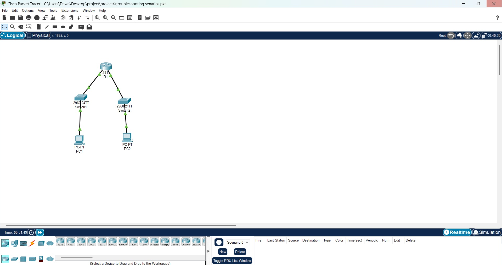

##  Project Overview

This project simulates **common Layer 2 and Layer 3 network issues** in a small LAN environment using **Cisco Packet Tracer**. The purpose is to identify, isolate, and fix problems such as:

-  Failed ping between hosts  
-  Incorrect or overly-permissive ACLs  
- Wrong IP configurations  
- Interface shutdown/misconnections  

This lab is ideal for students and engineers preparing for **CCNA troubleshooting questions** or real-world diagnostics.

---

##  Network Topology

**Devices:**

- 1 Router (R1 – Cisco 2911)
- 2 Switches (Switch1, Switch2 – 2960)
- 2 PCs (PC1, PC2)

```

PC1 --- Switch1 --- R1 --- Switch2 --- PC2

```

 **Ping between PC1 and PC2 initially fails** until troubleshooting is completed.



---

##  Objectives

- Practice identifying and resolving:
  - IP misconfiguration (wrong gateway, subnet, or IP)
  - Interface shutdown or misconnected cables
  - Access Control List (ACL) blocking traffic
  - Missing routes
- Learn how to verify and validate using CLI tools

---

##  Troubleshooting Checklist

|  Checkpoint                        |  Command / Fix                                    |
|-------------------------------------|-----------------------------------------------------|
| Check PC IP config                 | `ipconfig` (PC) or GUI settings                     |
| Check router interfaces            | `show ip interface brief`, `no shutdown`            |
| Verify ping from router to PCs     | `ping [PC IP]`                                      |
| Check ACLs                         | `show access-lists`, `show run`, `no access-list`   |
| Test routing config (if needed)    | `show ip route`, add `ip route` if missing          |
| Reconnect cables if needed         | Visual inspection or correct port selection         |

---

##  How to Use

1. Open the `.pkt` file in Cisco Packet Tracer
2. Start with basic ping tests (PC1 ↔ PC2)
3. Use CLI on router and PC to identify issues
4. Apply fixes (e.g., reassign IP, enable interfaces, remove ACL)
5. Re-test connectivity after each fix

---

##  Files

- `troubleshooting-scenarios.pkt` — Main lab project file
- `topology.jpg` — Network diagram
- `README.md` — Lab instructions and overview

---

##  Skills Practiced

- IP addressing and subnetting
- Basic routing
- ACL troubleshooting
- Interface diagnostics
- Packet flow and ping failure tracing
- CLI verification commands

---

##  Contributions

Feel free to fork this project and add more troubleshooting cases like:

- DHCP configuration
- VLAN misconfigurations
- Port security
- NAT issues

Pull Requests welcome!

